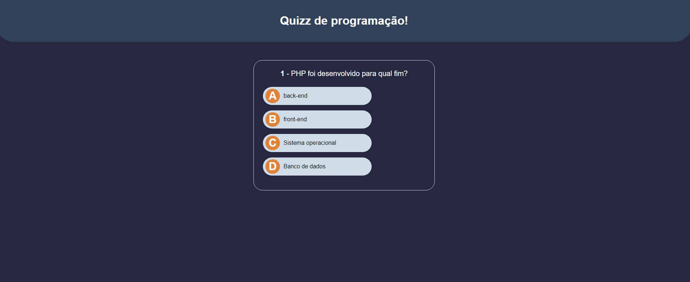

  <header>
    <h1>Projeto Quizz do curso JavaScript do básico ao avançado</h1>
    
O projeto Quizz é uma aplicação web simples, desenvolvida com as tecnologias HTML5, CSS3 e JavaScript. O objetivo do projeto é permitir que os usuários possam jogar quizzes sobre diversos temas e visualizar sua pontuação no final do jogo.

  </header>
  <figure>
     
    <figcaption>Quizz</figcaption>
   </figure>
  <section>
    <h2>Funcionalidades</h2>
    <h3>Interface Gráfica</h3>
    
A interface gráfica é composta por elementos HTML5 e estilizada com CSS3, para que o jogo seja visualmente atraente e fácil de usar.

    <h3>Manipulação do DOM</h3>
    
Para interagir com a interface gráfica, o JavaScript manipula o DOM (Document Object Model), adicionando e removendo elementos, alterando seus atributos e propriedades, e respondendo a eventos.

    <h3>Carregamento de Perguntas</h3>
    
As perguntas do quiz são carregadas de um arquivo JSON, que contém as informações sobre as perguntas, suas opções de respostas e a resposta correta. O JavaScript lê esse arquivo e adiciona as perguntas na interface gráfica.

    <h3>Verificação de Respostas</h3>
    
Quando o usuário escolhe uma opção de resposta, o JavaScript verifica se a resposta é correta ou não e atualiza a pontuação do jogador. Também destaca a opção escolhida pelo usuário e mostra a resposta correta na interface gráfica.

    <h3>Finalização do Jogo</h3>
    
Quando todas as perguntas são respondidas, o JavaScript mostra a pontuação final do jogador e permite que ele jogue novamente.

  </section>
  <section>
    <h2>Como utilizar</h2>
    <ol>
      <li>Clone o repositório do projeto para o seu computador</li>
      <li>Abra o arquivo index.html em um navegador</li>
      <li>Clique no botão "Começar" para iniciar o jogo</li>
      <li>Responda as perguntas e clique em "Próxima" para ir para a próxima pergunta</li>
      <li>Ao final das perguntas, sua pontuação será exibida e você poderá jogar novamente clicando no botão "Jogar novamente"</li>
    </ol>
  </section>
 
  <section>
    <h2>Funcionalidades</h2>
    <h3>Interface Gráfica</h3>
    
A interface gráfica é composta por elementos HTML5 e estilizada com CSS3, para que o jogo seja visualmente atraente e fácil de usar.

    <h3>Manipulação do DOM</h3>
    
Para interagir com a interface gráfica, o JavaScript manipula o DOM (Document Object Model), adicionando e removendo elementos, alterando seus atributos e propriedades, e respondendo a eventos.

    <h3>Carregamento de Perguntas</h3>
    
As perguntas do quiz são carregadas de um arquivo JSON, que contém as informações sobre as perguntas, suas opções de respostas e a resposta correta. O JavaScript lê esse arquivo e adiciona as perguntas na interface gráfica.

    <h3>Verificação de Respostas</h3>
    
Quando o usuário escolhe uma opção de resposta, o JavaScript verifica se a resposta é correta ou não e atualiza a pontuação do jogador. Também destaca a opção escolhida pelo usuário e mostra a resposta correta na interface gráfica.

    <h3>Finalização do Jogo</h3>
    
Quando todas as perguntas são respondidas, o JavaScript mostra a pontuação final do jogador e permite que ele jogue novamente.

  </section>
  <section>
    <h2>Como utilizar</h2>
    <ol>
      <li>Clone o repositório do projeto para o seu computador</li>
      <li>Abra o arquivo index.html em um navegador</li>
      <li>Clique no botão "Começar" para iniciar o jogo</li>
      <li>Responda as perguntas e clique em "Próxima" para ir para a próxima pergunta</li>
      <li>Ao final das perguntas, sua pontuação será exibida e você poderá jogar novamente clicando no botão "Jogar novamente"</li>
    </ol>
  </section>
